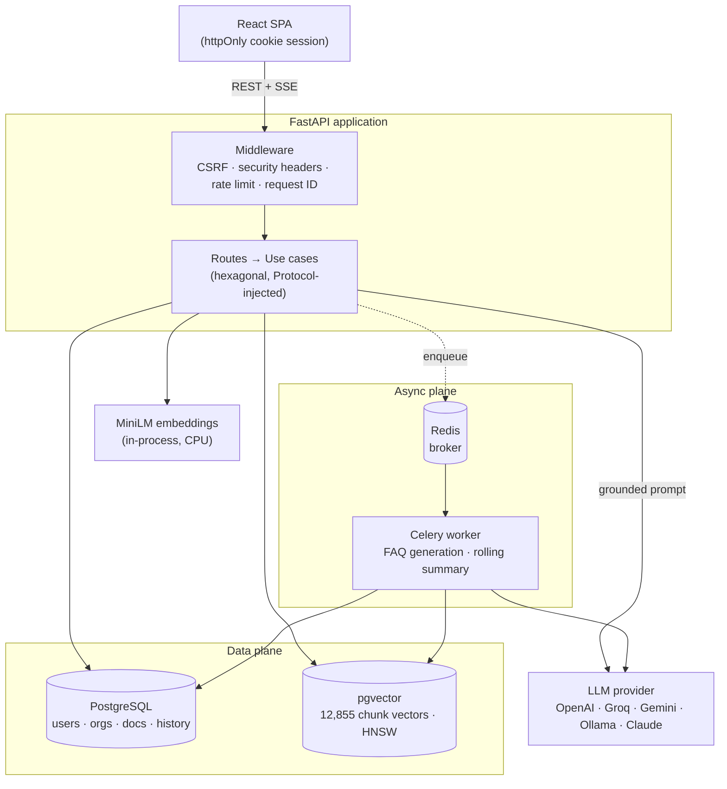
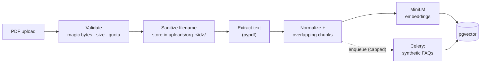
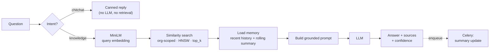
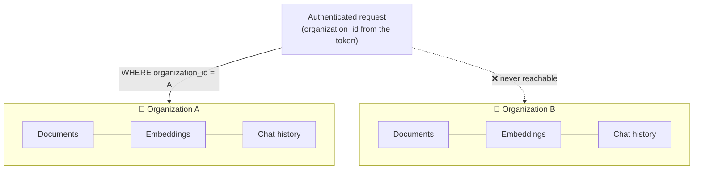

# 📚 Enterprise Business Knowledge Base Chatbot (RAG)

A production-style Retrieval Augmented Generation (RAG) system that
allows organizations to upload internal documents (PDFs) and interact
with them through an AI chatbot powered by semantic search, vector
embeddings, background workers, and cloud LLMs.

Built **from scratch — no LangChain** — combining document ingestion,
embeddings, pgvector similarity search, async workers, and grounded
LLM responses, the way modern enterprise AI assistants in SaaS
platforms and internal knowledge tools are built.

**Stack:** FastAPI · PostgreSQL + pgvector · Redis + Celery · Sentence Transformers (MiniLM) · Pluggable LLM (OpenAI / Groq / Gemini / Ollama / Claude) · SQLAlchemy + Alembic · Docker · React (Vite) demo UI

------------------------------------------------------------------------

<!-- ===================== DEMO MEDIA — ACTION REQUIRED =====================
Capture the 4 files described in docs/images/README.md, drop them into
docs/images/, then DELETE this comment's opening and closing markers to
publish the section. Until then it stays hidden so the README shows no
broken-image icons.

# 🎬 Demo


| Login | Upload & document list | Streamed answer + sources |
|---|---|---|
|  |  |  |

------------------------------------------------------------------------
======================================================================= -->

# ⚡ At a glance

| | |
|---|---|
| 📄 **Corpus indexed** | 500 PDFs → **12,855 vectors** (384-dim, HNSW) |
| ⚡ **Load test** | **24.3 req/s** sustained, **0 failures** @ 50 concurrent users |
| ⏱ **Streaming latency** | **318 ms** p50 time-to-first-token (real cloud LLM) |
| 🎯 **Answer accuracy** | **86.7%** correct vs **33.3%** for the same model without retrieval |
| 🛡 **Hallucination rate** | **2.0%** vs 4.0% baseline — a **50% reduction**, LLM-judged |
| ✅ **Tests** | **117**, gated in CI (ruff · black · pytest · CVE audit) |
| 🔌 **LLM providers** | **5**, swappable with one env variable |
| 🐳 **Deploy** | One command: `docker compose --profile app up` |

------------------------------------------------------------------------

# 🚀 Core Capabilities

- Multi-tenant architecture (organization-isolated data at every query)
- JWT authentication (OAuth2 password flow)
- Organization-scoped PDF uploads with integrity validation
- Duplicate filename versioning (safe re-uploads)
- Automatic text extraction, cleaning, and overlapping chunking
- Sentence Transformer embeddings (all-MiniLM-L6-v2, 384-dim)
- pgvector semantic similarity search
- pgvector semantic similarity search with an HNSW index, configurable
  top-k, and optional per-document filtering
- Optional **hybrid retrieval** (dense ⊕ keyword via Reciprocal Rank
  Fusion) and **cross-encoder reranking** — each measured and config-gated
  (see [Measured results](#-measured-results))
- Intent routing — chitchat handled instantly, knowledge questions go
  through the full RAG pipeline
- Synthetic FAQ generation as a Celery background task (retrieval boost)
- Two-tier conversational memory: recent history in the prompt + a
  rolling LLM-maintained summary updated asynchronously off the
  request path
- Grounded answers with source citations via a **pluggable LLM layer**
  — switch between OpenAI, Groq, Gemini, local Ollama, or Claude with
  one `.env` variable (`LLM_PROVIDER`)
- **SSE streaming** endpoint (`/chat/stream`) with time-to-first-token
  ~0.25s vs ~0.33s full response
- LLM-graded confidence score (high / medium / low) on every response,
  from the same call as the answer (no second round-trip)
- Centralized prompt templates + response parsers (`app/prompts/`)
- **Structured JSON logging** with a per-request correlation ID
  (`X-Request-ID` honored inbound, returned on every response)
- **Hardened auth & authorization** — httpOnly cookie sessions with CSRF
  protection, refresh-token rotation with reuse detection, and
  admin-gated corpus mutations. See [Security](#-security) below
- Document deletion with vector + file cleanup
- Alembic database migrations
- **One-command Docker startup** (`docker compose --profile app up`)
  — API, worker, Postgres, Redis, migrations included
- **GitHub Actions CI**: ruff + black + pytest + `pip-audit` CVE gate
  on every push
- **React demo frontend** (`frontend/`) — login, upload, streaming
  chat with confidence badges and sources
- **Held-out eval harness with committed results** — see
  [Measured results](#-measured-results) below
- **Load-tested at 50 concurrent users** (Locust, 4 uvicorn workers,
  zero failures) — see [Measured results](#-measured-results) below
- Pytest test suite (117 tests): chat, streaming, auth/refresh flow,
  cookie + CSRF transport, authorization gates, upload pipeline and
  abuse controls, tenant isolation, config validation, eval plumbing

------------------------------------------------------------------------

# 🧠 High-Level System Architecture



Every request carries an organization scope; retrieval, storage and the
background jobs all filter on it (see [Multi-tenancy](#-multi-tenancy)).

------------------------------------------------------------------------

# 🏛 Code Architecture (SOLID / Hexagonal)

The codebase follows a layered, dependency-inverted design:

    app/
    ├── api/             # FastAPI routes, schemas, auth dependencies
    ├── domain/          # Protocols (LLMService, EmbeddingService,
    │                    #   ChatHistoryRepository, IntentClassifier)
    ├── infrastructure/  # Implementations: LLM adapters + provider
    │                    #   factory, Sentence Transformers, chat history
    ├── use_cases/       # Business logic: chat routing, RAG chat,
    │                    #   upload, delete, signup, chitchat
    ├── composition/     # Dependency wiring (composition root)
    ├── services/        # Document processing, embedding store/search,
    │                    #   confidence scoring, FAQ generation
    ├── tasks/           # Celery background tasks
    ├── db/              # SQLAlchemy models + session
    └── core/            # Settings, security (JWT/bcrypt), auth cookies
                         #   + CSRF, structured logging, rate limiting,
                         #   Celery app

Use cases depend on **Protocols**, not concrete providers. The LLM
layer proves it: one OpenAI-compatible adapter serves OpenAI, Groq,
Gemini, and Ollama; a second adapter serves Claude — and a factory
picks one from `LLM_PROVIDER`, with zero changes to business logic.

### Patterns in use

| Pattern | Where | Why it's there |
|---|---|---|
| **Ports & Adapters** (hexagonal) | `domain/` Protocols vs `infrastructure/` implementations | Business logic never imports a vendor SDK |
| **Repository** | `ChatHistoryRepository`, `RefreshTokenRepository`, `ConversationSummaryRepository` | Persistence is swappable and mockable without a database |
| **Factory** | `infrastructure/llm/factory.py` | One env var selects the provider; adding one is a dict entry |
| **Strategy** | `LLMService` / `EmbeddingService` implementations | Interchangeable algorithms behind a stable contract |
| **Composition Root** | `composition/` | All wiring happens in one place; nothing else calls constructors |
| **Dependency Injection** | Constructor injection everywhere + FastAPI `Depends` | Every use case is unit-testable with fakes — that's how 117 tests run with no DB or LLM |
| **Singleton (bounded)** | `composition/singletons.py` via `lru_cache` | The 4-second MiniLM load happens once per process, not per request |

------------------------------------------------------------------------

# 🧩 Why no LangChain?

Deliberate, not an oversight. The retrieval pipeline here is ~200 lines
of explicit code, and that buys:

- **Understanding over abstraction** — chunking, embedding, vector
  search, prompt assembly and grounding are written out, not hidden
  behind a chain object. Every design decision below was actually made.
- **No framework lock-in** — swapping a provider is a factory entry.
  There's no chain/agent API churn to track between releases.
- **Lower latency** — the hot path is a query embedding, one SQL query
  and one LLM call. No callback machinery or intermediate serialization.
- **Debuggable stack traces** — failures point at project code, not
  five layers inside a framework.
- **A dependency I control** — fewer transitive packages, which matters
  when CI fails the build on any dependency CVE.

LangChain is a reasonable choice for rapid prototyping. This project
optimizes for demonstrating the internals and running them in production.

------------------------------------------------------------------------

# 🧠 Engineering decisions

| Decision | Rationale |
|---|---|
| **pgvector** over Pinecone/FAISS | Vectors live beside the relational data they belong to, so tenant isolation is a plain SQL `WHERE` — not a second system to keep consistent. No SaaS dependency, no sync job, transactional with the metadata. |
| **HNSW index** | Approximate search keeps retrieval ~flat as the corpus grows; exact scan over 12,855 vectors would degrade linearly. Retrieval is not the bottleneck — the LLM is (~130 ms median stack overhead under 50-user load). |
| **MiniLM (all-MiniLM-L6-v2)** | 384-dim, runs on CPU in-process. No embedding API cost, no network hop, no rate limit — and small enough that the load test embeds every query for real. |
| **Celery + Redis** | FAQ generation and summary updates are LLM-bound and slow; running them inline would put seconds on every upload/chat. They're enqueued so the request path stays fast. |
| **Protocol-based DI** | Enables the whole test suite to run with no Postgres, Redis or LLM — fast, deterministic CI. |
| **SSE for streaming** | Time-to-first-token is what users perceive (318 ms vs a full response). Chosen over WebSockets because the stream is one-directional; SSE needs no extra protocol handling, and `fetch()` handles POST bodies that `EventSource` cannot. |
| **Refresh-token rotation + reuse detection** | Access tokens stay stateless and short-lived; refresh tokens are stateful and single-use, so a stolen token is detectable — replaying a rotated one burns the whole family. |
| **httpOnly cookies over localStorage** | Tokens JavaScript cannot read survive an XSS. The cost is CSRF exposure, paid for with SameSite=Strict + a double-submit token. |
| **Request IDs in structured logs** | One correlation ID flows through routes, use cases and services via a `ContextVar`, so a single request's path is greppable across the whole system — without threading an argument through every signature. |
| **One LLM call for answer + confidence** | The grounding self-grade comes back in the same response as the answer, halving round-trips versus scoring separately. |

------------------------------------------------------------------------

# 🏗 Pipelines

## Document Upload Pipeline



1.  User uploads a PDF under their organization
2.  Backend validates PDF integrity & format
3.  Duplicate filenames auto-versioned
4.  File stored in an org-specific folder (`uploads/org_<id>/`)
5.  Metadata saved to Postgres
6.  Text extracted (pypdf), normalized, and split into overlapping chunks
7.  Chunk embeddings generated via MiniLM and stored in pgvector
8.  Celery task generates synthetic FAQs, embedded & stored for
    retrieval boosting

## Chat Pipeline



1.  Intent classified — greetings get an instant chitchat reply
2.  Knowledge questions are embedded via MiniLM
3.  Similarity search over the organization's embeddings (HNSW,
    configurable `top_k`, optional `document_ids` filter)
4.  Recent chat history + rolling conversation summary loaded
5.  Prompt constructed from context + memory (`app/prompts/`)
6.  Grounded answer generated by the configured LLM provider —
    buffered (`/chat`) or token-streamed over SSE (`/chat/stream`)
7.  Response returns the **answer**, **source filenames**, and an
    LLM-evaluated **confidence score**

------------------------------------------------------------------------

# 🔌 API Endpoints

| Method | Path | Description |
|---|---|---|
| `POST` | `/auth/signup` | Create an organization + first user |
| `POST` | `/auth/login` | OAuth2 login → access + refresh token pair |
| `POST` | `/auth/refresh` | Rotate a refresh token for a fresh pair |
| `POST` | `/auth/logout` | Revoke the session's whole refresh family |
| `GET` | `/me` | Current authenticated user |
| `GET` | `/documents` | List the organization's documents |
| `POST` | `/documents/upload` | Upload a PDF (triggers full RAG ingestion) |
| `DELETE` | `/documents/{id}` | Delete a document + its vectors + file |
| `POST` | `/chat` | Ask a question (RAG answer + sources + confidence) |
| `POST` | `/chat/stream` | Same, streamed as SSE token events |
| `GET` | `/health` | Health check |

Interactive docs: **http://127.0.0.1:8000/docs** (disabled in production).

### Example: ask a question

```http
POST /chat
Content-Type: application/json
Authorization: Bearer <access_token>

{ "question": "What is the vacation policy?", "top_k": 5 }
```

```json
{
  "question": "What is the vacation policy?",
  "answer": "Full-time employees accrue 20 days of paid leave per year, accruing monthly from the start date. Unused days carry over up to a maximum of 5.",
  "sources": ["employee_handbook.pdf", "hr_policy_2026.pdf"],
  "confidence": "high"
}
```

### Example: stream the same answer

`POST /chat/stream` returns Server-Sent Events — token events as the
model produces them, then a final `done` event with the metadata:

```
event: token
data: {"text": "Full-time employees accrue "}

event: token
data: {"text": "20 days of paid leave"}

event: done
data: {"sources": ["employee_handbook.pdf"], "confidence": "high"}
```

When nothing relevant is found, the model is instructed to abstain
rather than guess — that abstention behaviour is what produces the
**97.5%** correct-refusal rate in [Measured results](#-measured-results).

------------------------------------------------------------------------

# 🔐 Security

Built against the **OWASP Top 10 / ASVS**, with every control covered by
tests. Highlights by category:

**Authentication & sessions (A07)**
- Browser tokens live in **httpOnly + Secure + SameSite=Strict cookies**,
  so JavaScript can never read them (an XSS has nothing to exfiltrate).
  Bearer tokens are still accepted for programmatic clients.
- **Double-submit CSRF**: a readable `csrf_token` cookie must be echoed in
  an `X-CSRF-Token` header on cookie-authenticated state changes. Bearer
  requests are exempt (an attacker can't set that header cross-site).
- **Refresh-token rotation with reuse detection** — tokens are single-use
  and server-tracked; replaying a rotated token burns the entire token
  family. `/auth/logout` revokes it server-side.
- Typed JWTs (`access` / `refresh`) enforced both directions, fixed
  algorithm (no `alg=none` confusion), bcrypt password hashing.
- `SECRET_KEY` is validated at startup: placeholders are rejected in every
  environment, and production enforces a length floor.

**Authorization (A01)**
- Multi-tenant isolation is enforced in SQL on every query — cross-org
  access returns 404, never another tenant's data.
- Function-level authorization: only admins may mutate the shared corpus
  (upload/delete); reads and chat are open to any active member.

**Input handling & uploads (A03/A04)**
- Path-traversal-proof filenames, **PDF magic-byte** signature validation
  (the content-type header is client-controlled and not trusted), and a
  size cap — all enforced before the parser runs.
- Abuse controls: per-endpoint rate limits, a per-org document quota, and
  a cap on FAQ generation so one upload can't amplify into hundreds of
  LLM calls.
- All SQL is parameterized; the tenant filter is unconditional.

**Transport & headers (A05)**
- Strict **Content-Security-Policy** (no inline/eval script, `connect-src
  'self'`, `frame-ancestors 'none'`), plus `X-Content-Type-Options`,
  `X-Frame-Options`, `Referrer-Policy`, `Permissions-Policy`, opt-in HSTS.
- Interactive API docs are **disabled in production**.
- Rate limiting keys on a spoof-resistant client IP (`TRUSTED_PROXY_COUNT`
  controls how much of `X-Forwarded-For` is trusted).

**Supply chain & infrastructure (A05/A06)**
- CI fails the build on a known CVE in a shipped dependency (`pip-audit`),
  with every accepted exception documented inline.
- Containers run as a non-root user; Postgres and Redis publish on
  loopback only and Redis requires authentication.
- Celery pins JSON serialization (no pickle path) and enforces task time
  limits so a hung call can't pin a worker.

------------------------------------------------------------------------

# 🐘 Database Schema

  Table                 Purpose
  --------------------- -------------------------------------
  users                 Organization users & authentication
  organizations         Multi-tenant isolation
  documents             Uploaded PDF metadata
  document_embeddings   Chunk vectors + FAQ vectors (384-dim, HNSW)
  chat_history          Conversation memory (recent turns)
  conversation_summaries  Rolling per-user summary (long-term memory)
  refresh_tokens        Rotation + reuse detection (jti, family, revoked)

------------------------------------------------------------------------

# 🏢 Multi-tenancy

Every organization is an isolated island of data. Isolation is enforced
in **SQL on every query**, not in application `if` statements — so there
is no code path that can forget it.



The retrieval query hard-codes the tenant filter, and an optional
`document_ids` filter can only *narrow within* the organization — passing
another tenant's document id simply matches nothing. Requesting a
document that isn't yours returns **404, not 403**, so the API never
confirms that someone else's record exists.

------------------------------------------------------------------------

# ⚙ Setup

**Full step-by-step guide: [SETUP.md](SETUP.md)** — includes
prerequisites, environment variables, database initialization, and
troubleshooting.

Quick version (one command, everything in Docker):

```bash
copy .env.example .env    # fill in SECRET_KEY + your LLM key
docker compose --profile app up --build
# → API on http://127.0.0.1:8000 (migrations run automatically)
```

Or the host-dev flow:

```bash
# 1. Environment
python -m venv venv && venv\Scripts\activate      # Windows
pip install -r requirements/base.txt
copy .env.example .env                             # then edit values

# 2. Infrastructure only (Postgres + pgvector, Redis)
docker compose up -d

# 3. Database tables (the migration also enables the pgvector extension)
alembic upgrade head

# 4. Run (two terminals)
celery -A app.core.celery_app:celery worker --pool=solo -Q rag-queue --loglevel=info
uvicorn app.main:app --reload
```

Demo UI: `cd frontend && npm install && npm run dev` →
http://localhost:5173 (see [frontend/README.md](frontend/README.md)).

> ⏱ First startup takes ~40s (torch / sentence-transformers imports),
> and the first embedding call downloads the MiniLM model.

Dependencies are split under `requirements/`:
`base.txt` (runtime) · `test.txt` (pytest) · `dev.txt` (black, ruff, mypy).

------------------------------------------------------------------------

# 🧪 Tests

```bash
pip install -r requirements/test.txt
pytest
```

117 tests covering the chat router (intent dispatch), the RAG chat use
case, streaming (confidence-marker holdback), request validation,
prompt parsers, the auth flow (login / refresh rotation / reuse
detection / token-type separation / rate limiting), the cookie + CSRF
transport (accept, reject, forged token, Bearer exemption),
authorization gates (admin-only mutations), the upload pipeline
(failure cleanup, path traversal, magic bytes, size cap, quota and
amplification caps), security headers and CSP, `SECRET_KEY` validation,
the tenant-isolation SQL invariant, and the eval harness arithmetic —
with fakes injected via the domain Protocols (no database or LLM
needed). CI runs ruff, black, `pip-audit`, and the suite on every push.

------------------------------------------------------------------------

# 📊 Measured results

Full method + numbers: **[evals/README.md](evals/README.md)**.
Highlights from a 100-question held-out eval (500 Wikipedia-article
PDFs ingested; graded by an independent LLM judge):

| metric | RAG | vanilla (same model, no retrieval) |
|---|---:|---:|
| correct on answerable questions (n=60) | **86.7%** | 33.3% |
| correct abstention on out-of-KB questions (n=40) | **97.5%** | 62.5% |
| overall hallucination rate | **2.0%** | 4.0% |

Ingestion throughput: **59.8 docs/min · 25.6 chunks/sec**
(12,855 chunks from 500 PDFs, single process, CPU MiniLM, zero failures).

**Retrieval quality** (LLM-free, `evals/retrieval_eval.py`) — two
composable upgrades over plain dense retrieval:

| metric | dense | + hybrid | + rerank | hybrid + rerank |
|---|---:|---:|---:|---:|
| Recall@1 | 86.7% | 90.0% | 95.0% | **96.7%** |
| Recall@5 | 93.3% | 96.7% | 96.7% | **96.7%** |
| MRR | 0.901 | 0.920 | 0.956 | **0.968** |

**Hybrid** (dense ⊕ keyword, fused by RRF) raises the recall *ceiling* —
it recovers documents an embedding misses on exact terms. **Reranking**
(cross-encoder) raises *precision@1* within the pool. Together, Recall@1
climbs **+10 pp** to the pool ceiling. Each was headroom-checked and
measured before shipping ([evals/README.md](evals/README.md)).

**Load test** — full method + tables: **[benchmarks/README.md](benchmarks/README.md)**.
50 concurrent users (Locust) against 4 uvicorn workers for 3 minutes,
retrieval running over the full 12,855-chunk corpus, LLM simulated at
measured-realistic pacing (a free-tier cloud LLM can't sit inside a
50-user run — the real model is measured separately below):

| metric | value |
|---|---:|
| requests / failures | 4,360 / **0** |
| sustained throughput | 24.3 req/s |
| `/chat` p50 · p95 · p99 | 880 · 1,100 · 1,300 ms (incl. 750 ms simulated LLM → **~130 ms median stack overhead**) |
| stream first token p50 · p95 | 490 · 680 ms |

Real-LLM streaming time-to-first-token (production Groq model, n=20):
**p50 318 ms · p95 692 ms**.

------------------------------------------------------------------------

# 📈 Repository at a glance

| | |
|---|---|
| Python modules | **118** (73 application · 34 test · 11 tooling) |
| Lines of Python | **~3,230** application · **~1,950** test |
| React/CSS (demo UI) | ~640 lines |
| REST + SSE endpoints | **11** |
| Database tables | **7**, across **5** Alembic migrations |
| Background tasks | **2** Celery tasks (FAQ generation, rolling summary) |
| LLM providers | **5**, behind 2 adapters + a factory |
| Tests | **117**, no database or LLM required |

------------------------------------------------------------------------

# ⚠ Current limitations

Stated plainly — these are known boundaries, not undiscovered bugs:

- **No OCR.** Text is extracted with pypdf, so scanned/image-only PDFs
  yield nothing. Diagrams, charts and images inside PDFs are ignored.
- **No table-structure extraction.** Tables flatten into prose, which
  can blur row/column relationships in retrieved context.
- **Keyword arm is Postgres full-text, not true BM25.** Hybrid retrieval
  fuses dense vectors with `ts_rank_cd` over a GIN index — solid and
  dependency-free, but not term-saturating BM25. A dedicated BM25 engine
  (e.g. a ParadeDB/`pg_search` extension) would rank keyword relevance
  more precisely on long documents.
- **Rate limiting is per worker process.** Counters are in-memory, so
  with N uvicorn workers the effective ceiling is up to N× the
  configured limit. A shared Redis backend would fix this.
- **Single-node deployment.** Uploaded files live on a local volume, so
  horizontal scaling needs shared/object storage.
- **Access tokens aren't revocable** within their ~60-minute lifetime by
  design (stateless/stateful split); logout revokes refresh tokens
  immediately.
- **Expired refresh tokens accumulate** — no periodic cleanup job yet.
- **Benchmarks came from one machine**, with the load generator sharing
  hardware with the system under test. Numbers are conservative rather
  than flattering; see [benchmarks/README.md](benchmarks/README.md).

------------------------------------------------------------------------

# 🗺 Roadmap

- ✅ Multi-provider LLM support (OpenAI / Groq / Gemini / Ollama / Claude)
- ✅ Startup-time model loading & HNSW vector indexing
- ✅ Configurable top-k retrieval + metadata filtering
- ✅ Prompt templating module
- ✅ SSE streaming responses + summary memory
- ✅ Held-out eval harness with committed results (see above)
- ✅ Load benchmarks — Locust, 50 users, committed results (see above)
- ✅ CI pipeline (GitHub Actions), structured logging with request IDs,
  rate limiting + refresh tokens, one-command Docker startup, React
  demo frontend
- ✅ Refresh-token revocation store with rotation + reuse detection
- ✅ httpOnly-cookie auth for the SPA with double-submit CSRF
- ✅ Function-level authorization, CSP + security headers, dependency
  CVE gate in CI, ingestion abuse controls
- ✅ **Hybrid retrieval** — dense ⊕ Postgres full-text fused by RRF;
  raises the recall ceiling (config-gated, [evals/README.md](evals/README.md))
- ✅ **Cross-encoder reranking** — retrieve top-20, rerank to top-5;
  precision@1 **+8.3 pp** on its own, **+10 pp** stacked with hybrid
- ✅ **Retrieval metrics** — Recall@k and MRR eval (`evals/retrieval_eval.py`)
- Next, in priority order:
  1. **Observability** — Prometheus metrics + Grafana for retrieval,
     embedding and LLM latency
  2. True **BM25** keyword ranking (ParadeDB/`pg_search`) in place of
     Postgres `ts_rank`
  3. Redis-backed (multi-worker) rate limiting, expired-token cleanup,
     OCR for scanned PDFs, full-response p95 tuning

------------------------------------------------------------------------

# Design goals

The system is built to reflect how production RAG platforms — internal
knowledge assistants, private enterprise search, support automation — are
actually engineered, prioritizing:

- **Correctness you can measure**, not assert — every quality and
  performance claim in this README traces to a committed, reproducible
  eval or benchmark.
- **Security as a first-class requirement**, reviewed against the OWASP
  Top 10 on every change (see [Security](#-security)).
- **A dependency-inverted architecture** that keeps business logic free of
  frameworks and vendors, so providers and components are swappable and
  the whole system is testable without a database or an LLM.
- **Operational readiness** — structured logging, migrations, rate
  limiting, containerized deployment, and CI that gates the build.

------------------------------------------------------------------------

# Author

**Hritik Garg** — [garghritikgarg@gmail.com](mailto:garghritikgarg@gmail.com)
